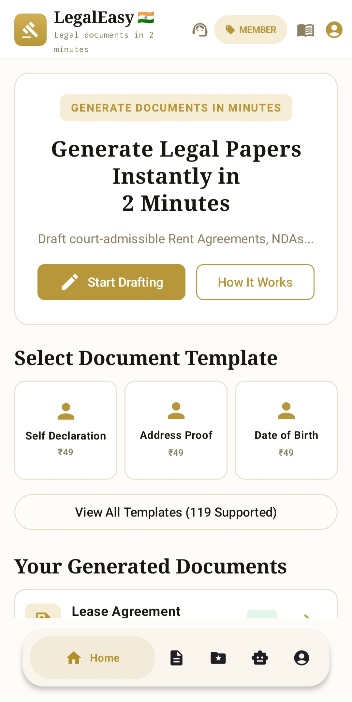
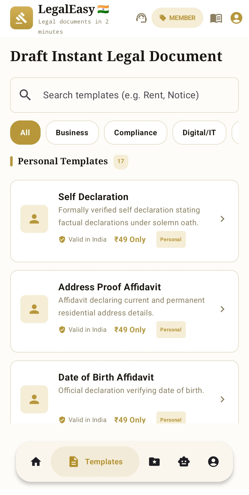
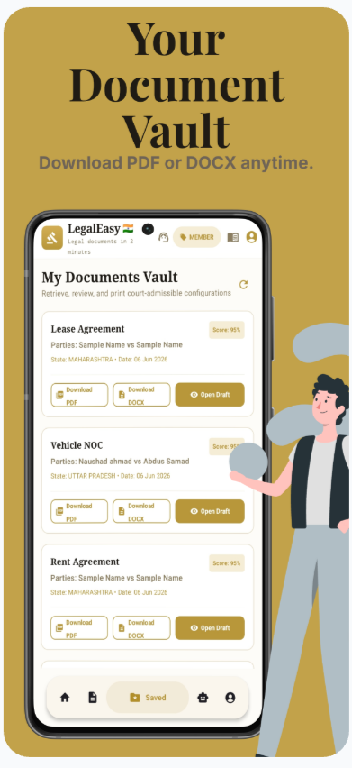
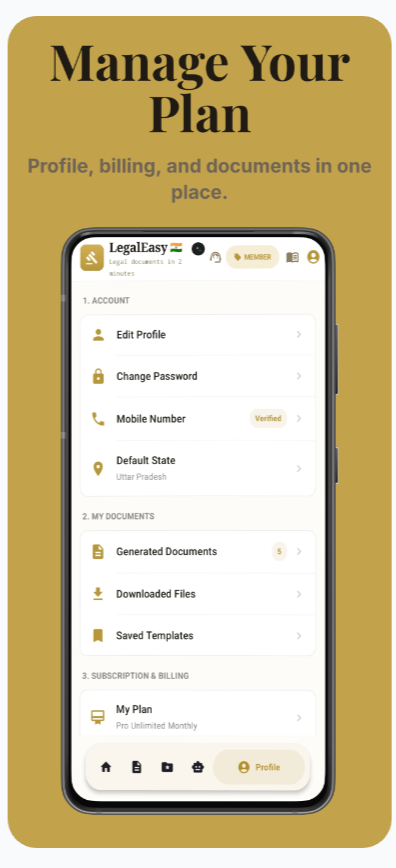

# ⚖️ LegalEasy — AI-Powered Legal Document Generator for India

<div align="center">


[](https://android.com)
[](https://kotlinlang.org)
[](https://firebase.google.com)
[](https://ai.google.dev)
[](LICENSE)
[](https://github.com)

**Generate legal Documents in 2 minutes. ₹49 mein, 2 minute mein.**

*India's first AI-powered legal document generation app — making professional legal documents accessible to every Indian, in every city, at a fraction of the cost.*

[Download App](https://www.mediafire.com/file/poze2b67wdetqx1/ci1zkn.apk/file) 

</div>
📸 Screenshots

| Home Screen | 119 Templates | Documents Vault |
|---|---|---|
|  |  |  |

| User Profile | Samvidhan AI |
|---|---|
|  |  |
---

## 📖 Table of Contents

- [What is LegalEasy?](#-what-is-legaleasy)
- [Why We Built This](#-why-we-built-this)
- [The Problem We Solve](#-the-problem-we-solve)
- [Key Features](#-key-features)
- [Document Categories](#-document-categories--119-templates)
- [How It Works](#-how-it-works)
- [Samvidhan AI](#-samvidhan-ai--indian-constitution-expert) (Powered by Meshapi by aifiesta).
- [Document Vault](#-my-documents-vault)
- [Pricing Model](#-pricing-model)
- [Technology Stack](#-technology-stack)
- [App Architecture](#-app-architecture)
- [Security & Legal Compliance](#-security--legal-compliance)
- [Screenshots](#-screenshots)
- [Getting Started](#-getting-started)
- [Contributing](#-contributing)
- [Legal Disclaimer](#-legal-disclaimer)

---

## 🇮🇳 What is LegalEasy?

**LegalEasy** is an Android application that uses Google Gemini AI to generate court-admissible legal documents for Indian users — instantly, affordably, and without needing a lawyer for routine paperwork.

From a simple rent agreement to an employment offer letter, a vehicle NOC to a government compliance declaration — LegalEasy covers **119 document types** across 16 categories, all tailored specifically to **Indian law**, **Indian court standards**, and **state-specific legal requirements**.

> *"India has 1.4 billion people but less than 3% can afford regular legal counsel. LegalEasy bridges this gap."*

Whether you are a tenant needing a rent agreement, a small business owner drafting a vendor contract, an HR manager issuing offer letters, a student requesting a bonafide certificate, or a landlord creating a property NOC — LegalEasy is built for you.

---

## 💡 Why We Built This

Every day in India, millions of ordinary people need legal documents:
- A student moving cities needs a rent agreement
- A landlord needs to draft a leave and license deed
- A small shop owner needs a vendor agreement
- An employee needs an experience letter
- A family needs an affidavit for a government office

The traditional path is expensive, slow, and inaccessible:

| Traditional Lawyer | LegalEasy |
|---|---|
| ₹2,000 – ₹5,000 per document | ₹49 per document |
| 2–5 days waiting | Under 2 minutes |
| Requires office visit | Works from your phone |
| English only | Hindi + English output |
| Available only in big cities | Works across all of India |
| Fixed business hours | 24/7, 365 days |

LegalEasy was built to democratize access to legal documentation — the same quality of paperwork that wealthy Indians get from expensive law firms, now available to a rickshaw driver in Lucknow, a farmer in Gujarat, or a startup founder in Tier 3 India.

---

## 🔴 The Problem We Solve

### 1. Cost Barrier
Legal documents in India are gatekept behind high lawyer fees. A standard rent agreement costs ₹2,000–5,000 from a local advocate. For someone earning ₹15,000/month, that is a significant expense for a document that follows a standard template.

### 2. Time Barrier
Getting a legal document drafted traditionally takes multiple visits to a lawyer's office, waiting periods of 2–5 days, back-and-forth revisions, and final execution — for paperwork that AI can generate in 2 minutes.

### 3. Geographic Barrier
70% of India lives in Tier 2, Tier 3, and rural areas where qualified legal professionals are scarce. LegalEasy works on any Android phone with an internet connection.

### 4. Language Barrier
Legal documents in India are almost exclusively in English — a language that the majority of Indians are not comfortable reading or understanding. LegalEasy generates documents in both **English and Hindi**, with state-specific legal language.

### 5. Knowledge Barrier
Most people don't know what clauses need to be in a rent agreement, what makes an affidavit legally valid, or what a proper legal notice must contain. LegalEasy's AI handles all of that — the user just fills in their specific details.

---

## ✨ Key Features

### 🤖 AI Document Generation Engine
The core of LegalEasy is powered by **Google Gemini 3.5 Flash**, customized with a proprietary legal corpus covering:
- Transfer of Property Act, 1882
- Indian Contract Act, 1872
- Code of Civil Procedure (CPC)
- State-specific Residential Tenancy Acts (all 28 states + 8 UTs)
- Shop and Establishment Acts
- Labour Laws and Employment regulations
- IT Act 2000 for digital/technology documents

Every document type has its own dedicated system prompt built around Indian legal requirements — not a generic template filler. The AI understands the structural difference between an **affidavit** (single deponent, sworn declaration, notary section), an **agreement** (two parties, WHEREAS clauses, numbered terms, witness section), a **letter** (business format, single sender), a **notice** (formal demand, deadline, legal consequences), and a **policy** (structured sections, no parties).

**AI Generation includes:**
- Mandatory clause validation — the AI checks that every legally required section is present
- Compliance scoring — every generated document receives a **Compliance Score (0–100)** showing how complete and legally sound it is
- State-specific customization — jurisdiction, applicable laws, and court references are auto-filled based on the user's state
- Stamp duty notices — relevant notifications about stamp duty requirements for applicable document types

---

### 📋 119 Document Templates Across 16 Categories

LegalEasy supports **119 carefully curated document types** — all legal, all safe, all relevant to everyday Indian users. See the full list in the [Document Categories](#-document-categories--119-templates) section below.

---

### 📝 Smart Multi-Step Form Flow
Generating a document on LegalEasy is not typing into a blank page. It is a guided, conversational experience:

1. **User selects** a document type from the library
2. **Step-by-step form** asks for the relevant details in plain Hindi/English — no legal jargon required
3. **Live preview** shows the forming document as fields are filled
4. **AI generates** the complete document with proper legal formatting
5. **Compliance score** is shown before download
6. **User downloads** PDF or DOCX instantly

The form adapts to the document type — a rent agreement form asks for rent amount, security deposit, and maintenance terms; an offer letter form asks for designation, CTC, and joining date. Every form is purpose-built, not generic.

---

### 🗂️ My Documents Vault
Every document generated on LegalEasy is securely stored in the user's **Documents Vault** — accessible forever, re-downloadable anytime.

**Vault features:**
- Full list of all generated documents with document name, party names, state, date, and compliance score
- **Download PDF** — properly formatted A4 legal document, ready to print on stamp paper
- **Download DOCX** — fully editable Microsoft Word format for modifications before execution
- **Open Draft** — view the full document text inside the app
- Documents remain accessible even if the user switches phones or reinstalls the app

---

### 🏛️ Samvidhan AI — Indian Constitution Expert
Beyond document generation, LegalEasy includes **Samvidhan AI** — a dedicated AI chatbot trained exclusively on the **Constitution of India**.

Users can ask:
- "What are my Fundamental Rights under Article 19?"
- "Can a state government impose curfew without notice?"
- "What does Article 21 say about right to life?"
- "What are Directive Principles of State Policy?"
- "How many seats does the Rajya Sabha have?"
- "What is the procedure for impeachment of the President?"

Samvidhan AI responds in clear, accessible language — making the Indian Constitution understandable to every citizen, not just lawyers and scholars.

---

### 🌍 Bilingual Output — English + Hindi
Every document can be generated in either **English** or **Hindi** — the user selects their preferred language before generation.

This is not a translation layer applied after the fact — the AI generates the document natively in the selected language with appropriate legal terminology for that language. Hindi documents use correct Devanagari script and standard Hindi legal phrases.

---

### 📍 State-Specific Legal Compliance
India has 28 states and 8 Union Territories, each with their own variations on:
- Rent Control and Tenancy Acts
- Shop and Establishment regulations
- Stamp duty requirements
- Court jurisdiction references

LegalEasy users set their **Default State** in their profile. Every generated document automatically incorporates state-specific legal references, correct jurisdiction clauses, and applicable state laws — making the document valid and relevant in that specific state, not generic.

---

### 🔒 Secure User Accounts
LegalEasy uses **Firebase Authentication** for all user accounts:
- Email and password registration with secure hashing
- OTP-based mobile number verification
- Persistent sessions — users stay logged in across app restarts
- Account recovery via email
- All user documents are associated with their authenticated Firebase UID — documents are private and only accessible to the owner

---

### 💳 Razorpay Payment Integration
Payments on LegalEasy are processed via **Razorpay** — India's leading payment gateway:
- UPI payment (GPay, PhonePe, Paytm, BHIM)
- Credit and debit cards
- Net banking
- Wallet payments
- Subscription management for Pro plans

Every payment is verified on the backend via Razorpay's signature verification before any document is unlocked — preventing fraudulent access.

---

### 🏷️ Flexible Pricing Plans
LegalEasy offers three pricing tiers to suit different user needs:

**Pay-As-You-Go** — ₹49 per document. Perfect for users who need documents occasionally. No subscription, no commitment.

**Pro Membership** — ₹299/month for unlimited documents. Ideal for HR professionals, business owners, landlords, and anyone who generates documents regularly.

**Member Badge** — Pro users get a visible MEMBER badge in the app and priority AI generation.

---

## 📚 Document Categories — 119 Templates

### 👤 Personal & Affidavit (17 documents)
| Document | Purpose |
|---|---|
| Self Declaration | General purpose sworn statement |
| Address Proof Affidavit | Current and permanent residential address |
| Date of Birth Affidavit | Verification of age and date of birth |
| Lost Document Affidavit | For lost academic certificates, IDs |
| Gap Certificate (Personal) | Reasons for academic or career gaps |
| Character Certificate | Character and background declaration |
| Income Certificate Declaration | Monthly or annual income declaration |
| Single Status Affidavit | Affirming unmarried / bachelor status |
| Marriage Affidavit | Solemn statement of marriage |
| Nationality Affidavit | Verification of national identity or citizenship |
| No Criminal Record Declaration | Declaration of a clean judicial record |
| Identity Declaration | Affirmation of legal name and physical identity |
| Domicile Declaration | Affirmation of permanent living state |
| Relationship Affidavit | Confirming relationships between family members |
| Minor Declaration | Sworn by parent or guardian on behalf of a minor |
| Senior Citizen Declaration | Required to claim elder benefits |
| Passport Affidavit | Required for passport reissue or name changes |

### 🏠 Property Documents (5 documents)
| Document | Purpose |
|---|---|
| Rent Agreement | Standard residential or commercial lease |
| Lease Agreement | Long-term property leasing terms |
| Leave and License Agreement | Detailed residential occupancy bounds |
| Property NOC | No objection certificate from landlord or society |
| Possession Letter | Receipt confirming flat or land handover |

### 🤝 Business Documents (12 documents)
| Document | Purpose |
|---|---|
| Vendor Agreement | B2B service and fulfillment rules |
| Supplier Agreement | Supply rates, SLA, and delivery terms |
| Agency Agreement | Commercial agent appointment and commissions |
| Distribution Agreement | Stocking distributor terms for retail |
| Business Agreement | General corporate collaboration |
| Consulting Agreement | Advisory and specialized milestone terms |
| Service Agreement | Core service delivery covenants |
| Commission Agreement | Referral and brokerage payouts |
| Collaboration Agreement | Strategic co-branding rules |
| Marketing Agreement | External marketing or PR agency campaigns |
| Reseller Agreement | Authorized reseller terms and conditions |
| Outsourcing Agreement | Offshoring project and operations terms |

### 👔 Employment Documents (20 documents)
| Document | Purpose |
|---|---|
| Employment Contract | Full employment and benefits structure |
| Offer Letter | Initial role and CTC proposition |
| Appointment Letter | Detailed HR joining confirmation |
| Experience Letter | Role tenure and achievements |
| Relieving Letter | Exit certificate and handover completion |
| Internship Agreement | Intern rules, duration, and stipends |
| NDA (Employee) | Confidentiality for company employees |
| Freelance Agreement | Contract for independent freelancers |
| Independent Contractor Agreement | Service rules for external contractors |
| Salary Certificate | Income proof for bank or credit applications |
| Resignation Letter | Formal exit notice |
| Warning Letter | HR disciplinary or performance notice |
| Promotion Letter | Career advancement confirmation |
| Transfer Letter | Internal relocation notice |
| Termination Letter | Off-boarding and separation notice |
| Work From Home Agreement | Remote work protocol |
| Employee Bond Agreement | Minimum service duration liabilities |
| Employment Verification Letter | HR confirmation of active status |
| Probation Confirmation Letter | Shift to permanent roll |
| HR Policy Acknowledgement | Sign-off on company handbooks |

### 👨‍👩‍👧 Family Documents (1 document)
| Document | Purpose |
|---|---|
| Marriage Affidavit | Official solemnization under the Marriage Act |

### 💡 Intellectual Property Documents (6 documents)
| Document | Purpose |
|---|---|
| NDA | Standard Non-Disclosure Agreement |
| Mutual NDA | Bilateral trade secret protection |
| Confidentiality Agreement | Simplified confidentiality terms |
| Software Ownership Agreement | Work-for-hire IT rights |
| Content Licensing Agreement | Publishing frameworks |
| Brand Licensing Agreement | Trademark and brand name licensing |

### 🌐 Digital & IT Documents (20 documents)
| Document | Purpose |
|---|---|
| Privacy Policy | Application or website data privacy policy |
| Terms and Conditions | Liability frameworks and platform usage |
| Cookie Policy | Tracker and analytics cookie statement |
| Website Disclaimer | Liability limits for websites |
| Mobile App Terms | Store usage and in-app purchase terms |
| Mobile App Privacy Policy | Specific rules for device location and data |
| SaaS Agreement | Cloud software enterprise subscription rules |
| Software License Agreement | On-premise self-hosted license |
| Data Processing Agreement | Sub-processor contracts |
| Data Sharing Agreement | B2B API and telemetry sharing protocol |
| API Usage Agreement | Developer request caps and rate limits |
| Website Development Agreement | UAT scope and launch terms |
| Digital Marketing Agreement | Campaign retainer covenants |
| Hosting Agreement | Server and cloud bandwidth SLAs |
| AI Usage Policy | Internal data training permissions |
| User Agreement | Community posting and interaction bounds |
| Community Guidelines | Moderation scope defining spam and bans |
| Refund Policy | Financial payout boundaries |
| Shipping Policy | Logistic return and delivery statement |
| Acceptable Use Policy | Network protection policy |

### ⚖️ Government & Compliance Documents (15 documents)
| Document | Purpose |
|---|---|
| NOC Certificate | Standard government or municipal no objection |
| GST Declaration | Turnover cap-based GST exception |
| GST Undertaking | ITC and input ledger adjustment claims |
| MSME Declaration | Micro or small entity prompt payment status |
| UDYAM Declaration | State UDYAM registration status |
| Startup Declaration | DPIIT compliant tax holiday declaration |
| Shop Act Declaration | Shop and Establishment registration filing |
| Compliance Certificate | Director affirmation of listing norms |
| Tax Declaration | Form claiming 80C or 80D deductions |
| PAN Declaration | Form 60 or PAN card non-allotment |
| Aadhaar Declaration | E-KYC biometric consent form |
| Import Export Declaration | Customs origin and commodity checks |
| Labour Compliance Declaration | Minimum wage and PF alignment |
| Environmental Compliance Declaration | Clean industrial pollutant claims |
| Government Tender Declaration | Municipal bid non-blacklisting |

### 🎓 Education Documents (10 documents)
| Document | Purpose |
|---|---|
| Bonafide Certificate Request | Active academic status application |
| Gap Certificate (Education) | Academic absence clarification |
| Student Declaration | Anti-ragging or attendance pledge |
| Internship Certificate | Completion of student projects |
| Training Certificate | Industrial or technical course verification |
| Recommendation Letter | Academic merit and profile testament |
| Scholarship Declaration | Income eligibility certification |
| Education Affidavit | Solemnly verifying marksheet elements |
| College Admission Declaration | Pledge covering fees and code of conduct |
| Academic Verification Letter | Authorized HR confirmation request |

### ⚕️ Healthcare Documents (4 documents)
| Document | Purpose |
|---|---|
| Health Insurance Claim Letter | TPA emergency hospital appeal |
| Health Record Request Form | Seeking MRI and clinical log records |
| Medical Fitness Certificate | Physical suitability verification |
| Patient Declaration | Accuracy of clinical admission charts |

### 🚗 Vehicle Documents (9 documents)
| Document | Purpose |
|---|---|
| Vehicle Sale Agreement | Car or bike purchase and handover |
| Vehicle Transfer Agreement | Transfer of RTO responsibilities |
| Vehicle NOC | Financier or RTO out-of-state clearance |
| Driver Authorization Letter | Permit to drive corporate or personal assets |
| Vehicle Lease Agreement | Operator commercial fleet rentals |
| Vehicle Loan Agreement | Financier EMI hypothecation terms |
| Vehicle Ownership Declaration | Custody of unregistered vehicles |
| Vehicle Rental Agreement | Self-drive terms for renters |
| Accident Declaration Letter | Crash or incident explanation for insurers |

---

## ⚙️ How It Works

```
Step 1 ──► User opens LegalEasy and browses 119 document templates
              organised by category (Personal, Property, Business, etc.)

Step 2 ──► User selects the required document type
              (e.g. "Rent Agreement")

Step 3 ──► App shows a smart multi-step form
              with only the fields relevant to that document type
              (e.g. landlord name, tenant name, property address,
               rent amount, security deposit, state, duration)

Step 4 ──► User fills in their specific details in plain English or Hindi
              — no legal knowledge required

Step 5 ──► AI Generation begins
              Google Gemini receives the user's inputs along with
              a document-family-specific system prompt that enforces
              the correct legal structure for that exact document type

Step 6 ──► Generated document appears with:
              • Full legal text formatted to Indian court standards
              • Compliance Score showing completeness (e.g. 95/100)
              • All mandatory clauses present and highlighted
              • Stamp duty notice if applicable
              • State-specific jurisdiction reference

Step 7 ──► User downloads the document:
              • PDF — print-ready, A4, stamp paper compatible
              • DOCX — editable Microsoft Word format

Step 8 ──► Document is saved to the user's Documents Vault
              — accessible forever, re-downloadable anytime
```

---

## 🏛️ Samvidhan AI — Indian Constitution Expert (Powered by Meshapi by aifiesta).

**Samvidhan AI** is a specialized AI assistant embedded in LegalEasy that is trained exclusively on the **Constitution of India**. It is not a general chatbot — it is a focused legal knowledge engine for constitutional questions.

### What Samvidhan AI knows: (Powered by Meshapi by aifiesta). 
- All 448 Articles of the Indian Constitution
- All 12 Schedules
- All 104 Constitutional Amendments (as of current date)
- Fundamental Rights (Part III) — Articles 12 to 35
- Directive Principles of State Policy (Part IV)
- Fundamental Duties (Article 51A)
- Powers and structure of Parliament, State Legislatures
- Judiciary — Supreme Court, High Courts, subordinate courts
- Emergency provisions — Articles 352, 356, 360
- Centre-State relations and federal structure
- Important landmark Supreme Court judgments

### How to use Samvidhan AI:
Navigate to the **Chatbot AI** tab in the bottom navigation. Type any question about the Indian Constitution in English or Hindi. Samvidhan AI responds with accurate, referenced, plain-language explanations.

**Example questions:**
- *"What fundamental rights are guaranteed under Article 21?"*
- *"Can the President of India be impeached? What is the process?"*
- *"What is the Preamble to the Constitution?"*
- *"What is the difference between Fundamental Rights and Directive Principles?"*
- *"Which constitutional article deals with Right to Education?"*

---

## 📂 My Documents Vault

The **Documents Vault** is the user's personal secure repository of all generated documents.

### Features of the Vault:

**Document Cards** — Each generated document appears as a card showing:
- Document name (e.g. "Lease Agreement")
- Parties involved (e.g. "Naushad Ahmad vs Abdus Samad")
- State (e.g. "UTTAR PRADESH")
- Generation date
- Compliance Score badge (e.g. "Score: 95%")

**Download Options:**
- **Download PDF** — High-quality A4 PDF with proper legal formatting, margins, heading styles, signature lines, and witness sections. Print-ready for stamp paper.
- **Download DOCX** — Editable Word document in the same format, for users who need to make modifications before executing.

**Open Draft** — View the full document text inside the app, scroll through it, and verify all details before downloading.

**Persistence** — Documents are stored in Firebase Firestore linked to the user's account. They are accessible from any device where the user logs in, and are never lost even if the app is uninstalled.

---

## 💰 Pricing Model

| Plan | Price | Documents | Best For |
|---|---|---|---|
| **Pay-As-You-Go** | ₹49 / document | Pay per use | Occasional users |
| **Pro Membership** | ₹299 / month | Unlimited | HR managers, business owners, landlords |

### Why ₹49?
The average lawyer in India charges ₹2,000–5,000 for a standard legal document. LegalEasy delivers the same quality at **₹49** — a 40x to 100x cost reduction — making professional legal documentation accessible to 97% of Indians who currently cannot afford it.

---

## 🛠️ Technology Stack

| Layer | Technology | Why |
|---|---|---|
| **Language** | Kotlin | Modern, safe, concise Android development |
| **UI Framework** | Android Views + Material 3 | Native performance, Material You design |
| **AI Engine** | Google Gemini 3.5 Flash | Meshapi by aifiesta |Best-in-class document generation for Indian legal text |
| **Authentication** | Firebase Auth | Secure, scalable, email + phone support |
| **Database** | Firebase Firestore | Real-time NoSQL, scales to millions of users |
| **Storage** | Firebase Storage | Secure document file storage |
| **Payments** | Razorpay | India-first payment gateway, UPI + cards + wallets |
| **PDF Generation** | Android PdfDocument + custom renderer | Native PDF generation without external dependencies |
| **DOCX Generation** | Apache POI / custom DOCX writer | Standards-compliant Word document output |
| **Architecture** | MVVM + Repository pattern | Clean, testable, maintainable code structure |
| **Async** | Kotlin Coroutines + Flow | Efficient async operations, real-time data streams |


---

## 🔒 Security & Legal Compliance

### Data Security
- All user data is stored in Firebase Firestore with **Row Level Security** — users can only access their own documents
- Firebase Authentication handles all credential management — passwords are never stored in the app or on any custom server
- Payment data never passes through LegalEasy servers — all transactions are handled directly by Razorpay's PCI-DSS compliant infrastructure
- API keys (Gemini, Razorpay) are stored in server-side environment variables, never in the app binary

### Legal Positioning
LegalEasy is positioned as a **legal document drafting tool**, not a law firm. The distinction is important:
- ✅ Document generation (what we do) — fully legal under Indian law
- ✅ Template provision — fully legal
- ✅ AI-assisted drafting — fully legal
- ❌ Legal advice — only licensed advocates can provide this
- ❌ Court representation — only registered advocates can do this

Every generated document carries a disclaimer:
> *"This document is an AI-assisted draft generated via LegalEasy. It is not legal advice. Please verify all details and consult a qualified professional or notary before relying on this document for official use."*

### Documents Intentionally Excluded
The following document types are **not included** in LegalEasy due to regulatory complexity or mandatory professional involvement requirements:
- Court filings (Vakalatnama, Bail Applications, Writ Petitions)
- Property registration deeds (Sale Deed, Gift Deed, Mortgage Deed)
- SEBI-regulated investment agreements (SAFE, Share Subscription, Investor Agreements)
- Divorce and child custody documents (require Family Court involvement)
- Medical consent forms (require doctor involvement)

These may be introduced in future versions with appropriate lawyer review safeguards.
---

## 🗺️ Roadmap

### Version 1.1 (Coming Soon)
- [ ] Hindi interface language (full app in Hindi)
- [ ] WhatsApp sharing — share generated documents directly via WhatsApp
- [ ] Document templates marketplace — community-contributed templates
- [ ] Bulk generation — generate multiple documents in one session

### Version 1.2
- [ ] Voice input — dictate document details instead of typing
- [ ] OCR form fill — photograph an old document and auto-fill new form
- [ ] Stamp paper ordering — partner with stamp vendors for doorstep delivery

### Version 2.0
- [ ] Lawyer review marketplace — verified advocates review documents for ₹499
- [ ] E-registration integration — submit to state e-registration portals
- [ ] Advanced document types — property deeds, investment agreements (with lawyer review required)
- [ ] iOS app

---


### Areas Where Help is Needed
- **Legal template accuracy** — If you are a legal professional and spot incorrect clause language, please raise an issue
- **Regional language support** — Help with document generation in Marathi, Tamil, Telugu, Bengali, Gujarati, Kannada
- **Bug reports** — Found a document generation issue? Please open an issue with the document type and the generated output
- **UI/UX improvements** — Design suggestions and implementations welcome

---

## 📄 Legal Disclaimer

LegalEasy is an AI-powered document drafting tool and does **NOT** constitute a law firm, legal advice service, or advocate practice. All documents generated by LegalEasy are AI-assisted drafts for reference purposes only.

- LegalEasy is **not** registered as a law firm under the Advocates Act, 1961
- Generated documents are **not** a substitute for advice from a qualified legal professional
- Users should consult a licensed advocate before using any generated document in legal proceedings
- LegalEasy is **not responsible** for any legal outcomes resulting from the use of generated documents
- Documents may require notarization, stamp duty, or registration under applicable Indian law — it is the user's responsibility to fulfil these requirements
---

## 📞 Contact & Support

- **Email:** abdussamad88815@gmail.com
- **Instagram:** [@legaleasy](https://instagram.com/legaleasy) 

---

## ⭐ Show Your Support

If LegalEasy helped you or you believe in making legal services accessible to all Indians, please give this repository a ⭐ star — it helps more people discover the project.

---

<div align="center">

**Made with ❤️ for India 🇮🇳**

*Enabling 1.4 Billion Indians to navigate legal documents easily.*

© 2026 LegalEasy. All rights reserved.

</div>
